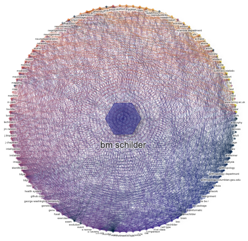

```{r setup, include=FALSE}
source(here::here("code","functions.R"))
knitr::opts_chunk$set(
  results='asis', 
  echo = FALSE
)
htmltools::tagList(fontawesome::fa_html_dependency())
```

<!-- Tutorial:  https://towardsdatascience.com/create-your-resume-with-pagedown-package-in-r-123ca6310d52 -->
<!-- pagedown Issues: https://github.com/rstudio/pagedown/issues -->
<!-- pagedown, embedding htmlwidgets: https://github.com/rstudio/pagedown/issues/76 -->
<!-- datadrivencv package: https://github.com/nstrayer/datadrivencv -->
<!-- textnets vignette: https://sicss.io/2020/materials/day3-text-analysis/text-networks/rmarkdown/Text_Networks.html -->
<!-- font awesome version issues: https://github.com/rstudio/rmarkdown/issues/2276 -->
<!-- add page numbers: https://github.com/rstudio/pagedown/issues/98 -->

<!-- Only show sidebar on first page: https://github.com/rstudio/pagedown/issues/147 -->
```{css, echo=FALSE} 
.pagedjs_page:not(:first-of-type) {
  --sidebar-width: 1rem;
  /*--sidebar-background-color: #ffffff;*/
  --main-width: calc(var(--content-width) - var(--sidebar-width));
  --decorator-horizontal-margin: 0.2in;
}
```

# Aside 

```{r, warning=FALSE, message=FALSE}
# visnet <- build_network(show_plot = FALSE,
#                         save_path = here::here("network","visnetwork.html"))
# visNetwork::renderVisNetwork(visnet)
# htmltools::includeHTML("https://bschilder.github.io/CV/network/visnetwork.html")
```

## Contact {#contact}

```{r}
parse_profile(types = c("email","website","phone"))
```

## Summary {#summary}

<h4>  
```{r}
build_summary()
```
</h4>

## Table of Contents {#toc}

```{r}
build_toc()
```

<hr>

```{r}
build_footer()
```

# Main

## Brian M. Schilder <a href="https://bschilder.github.io/CV/network/visnetwork.html" target="_blank"></a> {#title}

Passionately pursuing multi-disciplinary research to improve human lives.

### Imperial College London 
### PhD Candidate
### ScB, MPhil


## Education {data-icon=`r icon_dict("education")` data-concise="true" #education}

```{r}
parse_education()
```

## Core Skills {data-icon=`r icon_dict("skills")` #skills}

```{r}
parse_skills()
```


## Publications {data-icon=`r icon_dict("publications")` #publications}

```{r}
parse_publications(types = "publication")
```

## Preprints {data-icon=`r icon_dict("preprints")` #preprints}

```{r}
parse_publications(types = "preprint")
```

## Acknowledgements {data-icon=`r icon_dict("acknowledgements")` #acknowledgements}

```{r}
parse_publications(types = "acknowledgement")
```

## Reviewerships {data-icon=`r icon_dict("reviewerships")` #reviewerships}

```{r}
parse_publications(types = "reviewership")
```

## Internal Talks {data-icon=`r icon_dict("posters")` #internal_talks}

```{r}
parse_talks(types = "internal")
```

## Invited Talks {data-icon=`r icon_dict("posters")` #invited_talks}

```{r}
parse_talks(types = "invited")
```

## Conference Talks {data-icon=`r icon_dict("posters")` #conference_talks}

```{r}
parse_talks(types = "conference")
```


## Conference Posters {data-icon=`r icon_dict("posters")` #posters}

```{r}
parse_publications(types = "poster")
```

## Research Experience {data-icon=`r icon_dict("experience")` #experience}

```{r}
parse_experience(types = "research")
```

## Teaching / Mentoring Experience {data-icon=`r icon_dict("teaching")` #teaching}

```{r}
parse_experience(types = "teaching")
```

## Software Packages {data-icon=`r icon_dict("packages")` #packages}

```{r}
parse_tools(types = "package")
```

## Databases / Web Apps {data-icon=`r icon_dict("databases")` #databases}

```{r}
parse_tools(types = c("database","web app"))
```

## Websites {data-icon=`r icon_dict("websites")` #websites}

```{r}
parse_tools(types = "website")
```

## Grants {data-icon=`r icon_dict("grants")` #grants}

```{r}
parse_grants(types = "grant", 
             add_totals = TRUE)
```

## Awards {data-icon=`r icon_dict("awards")` #awards}

```{r}
parse_grants(types = "award")
```

## Affiliations {data-icon=`r icon_dict("affiliations")` #affiliations}

```{r}
parse_profile(types = "affiliation", 
              sep = "\n\n",
              collapse = "\n\n",
              div=NULL,
              img_width = "150px",
              prefix="### ")
```

## Data Visualisation / Artwork Portfolio {data-icon=`r icon_dict("data_visualisation")` #data_visualisation}

```{r}
parse_experience(types = "data visualisation")
```

## Extracurricular Experience {data-icon=`r icon_dict("extracurricular")` #extracurricular}

```{r}
parse_experience(types = "extracurricular")
```
